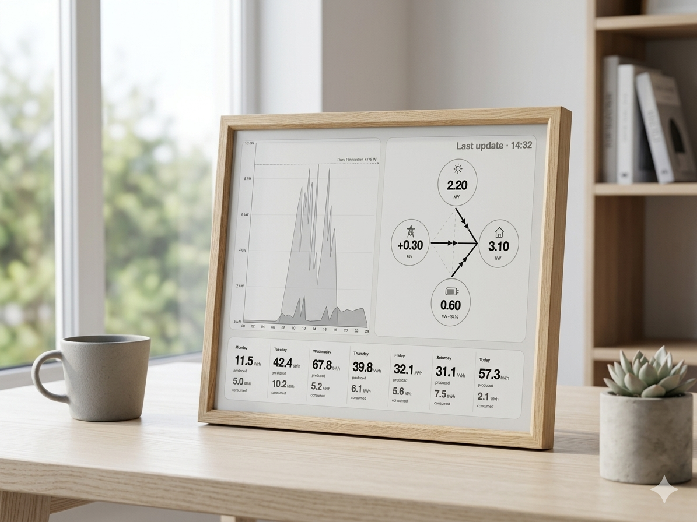
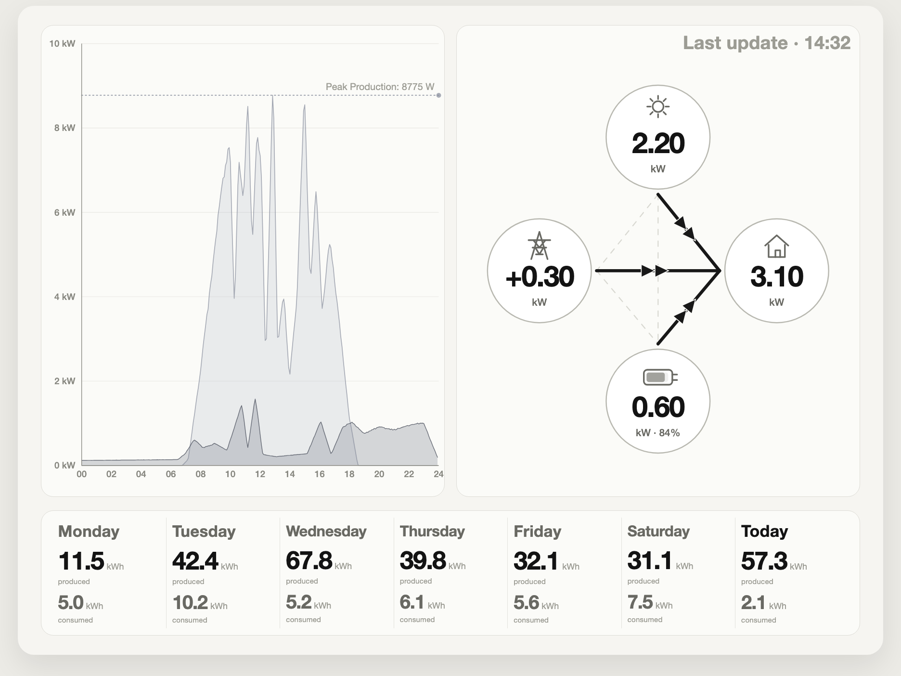
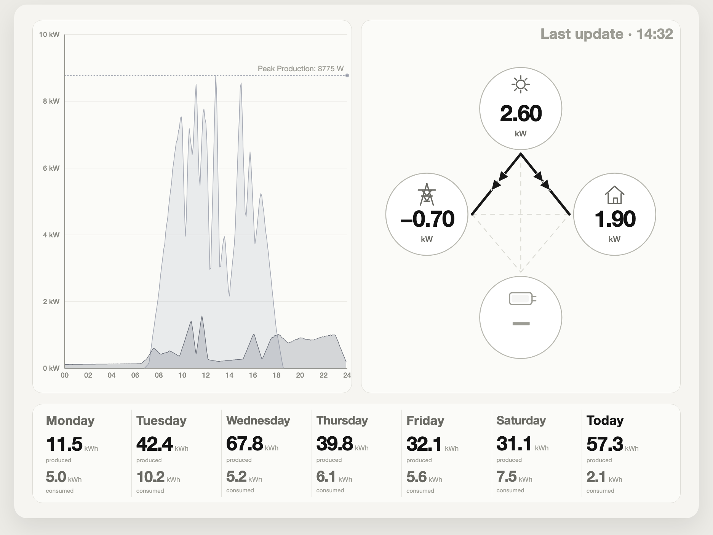
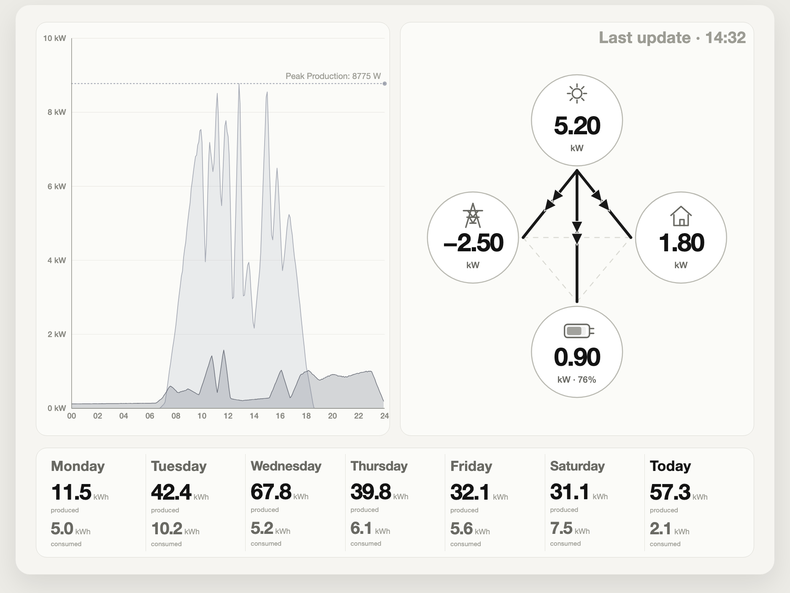

# Solar E-Ink Dashboard

> A wall-mounted e-paper display for your Solar Manager. Shows live energy flow, today's production vs. consumption, and 7-day history at a glance.

<p align="center">
  
</p>

**What the display shows:**

- Live energy flow between solar, grid, home, and battery
- 24-hour production vs. consumption chart with peak marker
- 7-day energy history (produced and consumed in kWh)
- Multilingual: English, German, French, Italian

<table>
  <tr>
    <td align="center"><strong>Standard</strong></td>
    <td align="center"><strong>No Battery</strong></td>
    <td align="center"><strong>PV Surplus</strong></td>
  </tr>
  <tr>
    <td></td>
    <td></td>
    <td></td>
  </tr>
</table>

## What You Need

| Part | Specification |
|---|---|
| Solar Manager gateway | Any gateway exposing the local v2 API (`/v2/stream`, `/v2/point`) |
| Raspberry Pi 5B | 4 GB RAM is fine as the reference target |
| Waveshare 7.8" e-Paper HAT | IT8951 controller, 1872×1404, black/white panel with 2-16 grayscale levels |
| microSD card | SanDisk Extreme PRO 128 GB (reference card) |
| Power supply | USB-C, 5V/5A recommended for Pi 5 (5V/3A works only with reduced peripheral budget) |
| Frame / mount | Your choice, display area is 7.8" diagonal |

> **Note:** The VCOM voltage is printed on the display's FPC ribbon cable label. You'll need it during setup.

## Quick Start

### 1. Flash Raspberry Pi OS

Use [Raspberry Pi Imager](https://www.raspberrypi.com/software/) to flash Raspberry Pi OS (64-bit). Enable SSH and configure your Wi-Fi during setup.

The setup script requires `python3.12`. See `scripts/setup-pi.sh` for how it is installed on your OS version.

### 2. Clone the repo and run setup

```bash
git clone https://github.com/phaupt/solay.git
cd solay
bash scripts/setup-pi.sh
```

This installs system dependencies, creates a Python virtual environment, installs the IT8951 display driver, sets up Playwright, and registers the systemd service.

### 3. Edit `.env.local`

The setup script creates `.env.local` in the repo root. Open it and set your values:

```dotenv
SM_LOCAL_BASE_URL=https://<your-gateway-ip>
EPAPER_VCOM=<from your display FPC label, e.g. -1.48>
DASHBOARD_LANGUAGE=EN
```

Use the **Solar Manager gateway IP**, not the inverter IP. The setup script defaults language to `DE`. Change to your preferred language.

### 4. Reboot, then validate the display

```bash
sudo reboot
```

After reboot, test the e-paper display:

```bash
cd solar-eink-dashboard
./.venv312/bin/python scripts/epaper_test.py --vcom <your-vcom>
```

You should see a test pattern on the display.

### 5. Start the dashboard

```bash
sudo systemctl start solar-dashboard
sudo systemctl status solar-dashboard
```

The dashboard should now be collecting data and updating the display. The service auto-starts on boot (configured by the setup script).

## How It Works

```
Solar Manager gateway → local collector → SQLite → HTML renderer → Playwright PNG → e-paper display
```

The Pi connects to the Solar Manager gateway on your LAN via WebSocket, collects live energy data, and stores it in a local SQLite database. A rendering pipeline converts the dashboard to HTML, screenshots it to a grayscale PNG via Playwright, and pushes it to the e-paper display periodically (default: every 60 seconds, configurable via `DISPLAY_UPDATE_INTERVAL`).

## Configuration

All settings are configured via environment variables in `.env.local`.

### Key settings

| Variable | Description | Default |
|---|---|---|
| `SM_LOCAL_BASE_URL` | Solar Manager gateway address | `http://192.168.1.XXX` |
| `SM_LOCAL_API_KEY` | Optional gateway API key | (empty) |
| `EPAPER_VCOM` | VCOM voltage from display FPC label (required for production) | (empty) |
| `DASHBOARD_LANGUAGE` | Display language: `EN`, `DE`, `FR`, `IT` | `EN` |
| `TZ` | Timezone | `Europe/Zurich` |
| `DISPLAY_UPDATE_INTERVAL` | E-paper refresh cadence in seconds | `60` |

### TLS configuration

TLS verification is enabled by default. For gateways with self-signed certificates, choose one (in order of preference):

1. **Certificate pinning (recommended):** `SM_LOCAL_TLS_FINGERPRINT_SHA256=<sha256-fingerprint>`
2. **Custom CA bundle:** `SM_LOCAL_CA_BUNDLE=/path/to/ca.pem`
3. **Disable verification (last resort):** `SM_LOCAL_VERIFY_TLS=false`

## Cloud Backfill (optional)

The local gateway has no historical data endpoint. If you restart the Pi, the 7-day history chart will have gaps. The optional cloud backfill fills in:

- **Previous days:** missing daily summaries from before the restart
- **Today's gap:** the period between midnight and whenever the Pi first started collecting

To enable it, add to `.env.local`:

```dotenv
SM_CLOUD_BACKFILL_ENABLED=true
SM_CLOUD_EMAIL=you@example.com
SM_CLOUD_PASSWORD=your-password
SM_CLOUD_SMID=your-smid
SM_CLOUD_BACKFILL_DAYS=7
SM_CLOUD_BACKFILL_INTERVAL_SECONDS=300
```

## Development

For local development without hardware:

```bash
# Setup (dev machine)
python3.12 -m venv .venv312
./.venv312/bin/pip install -r requirements.txt
./.venv312/bin/python -m playwright install chromium

# Run with mock data
./.venv312/bin/python main.py --mock --port 8090
```

Open `http://127.0.0.1:8090/` for the mock dashboard or `http://127.0.0.1:8090/scenarios` for the scenario matrix.

See [CONTRIBUTING.md](CONTRIBUTING.md) for the full developer workflow, testing, and preview modes.

## Troubleshooting

### Display not detected after setup

**Symptom:** `epaper_test.py` fails with a device error.
**Cause:** SPI was just enabled and needs a reboot.
**Fix:**
```bash
sudo reboot
```

### Garbled or faint display

**Symptom:** Display shows noise or very faint image.
**Cause:** Wrong VCOM voltage.
**Fix:** Check the FPC ribbon cable label on your display panel and update `EPAPER_VCOM` in `.env.local` to match (e.g. `-1.48`). Then restart:
```bash
sudo systemctl restart solar-dashboard
```

### Gateway not found

**Symptom:** Dashboard shows no data or connection errors in logs.
**Cause:** Wrong IP address, firewall blocking, or using the inverter IP instead of the gateway IP.
**Fix:**
1. Verify the IP is your **Solar Manager gateway**, not the inverter
2. Test connectivity: `curl -k https://<your-gateway-ip>/v2/point`
3. Update `SM_LOCAL_BASE_URL` in `.env.local`

### Dashboard not updating

**Symptom:** Display is stuck on an old image.
**Cause:** Service may have stopped or crashed.
**Fix:**
```bash
sudo systemctl status solar-dashboard
sudo journalctl -u solar-dashboard -f
```

### TLS certificate errors

**Symptom:** Connection refused or SSL errors in logs.
**Cause:** Gateway uses a self-signed certificate.
**Fix:** Add certificate pinning to `.env.local`:
```bash
# Get the fingerprint from your gateway
openssl s_client -connect <gateway-ip>:443 < /dev/null 2>/dev/null \
  | openssl x509 -fingerprint -sha256 -noout
```
Then add to `.env.local`:
```dotenv
SM_LOCAL_TLS_FINGERPRINT_SHA256=<the-fingerprint>
```

## License

[PolyForm Noncommercial 1.0.0](LICENSE). Free for personal, educational, and noncommercial use.
