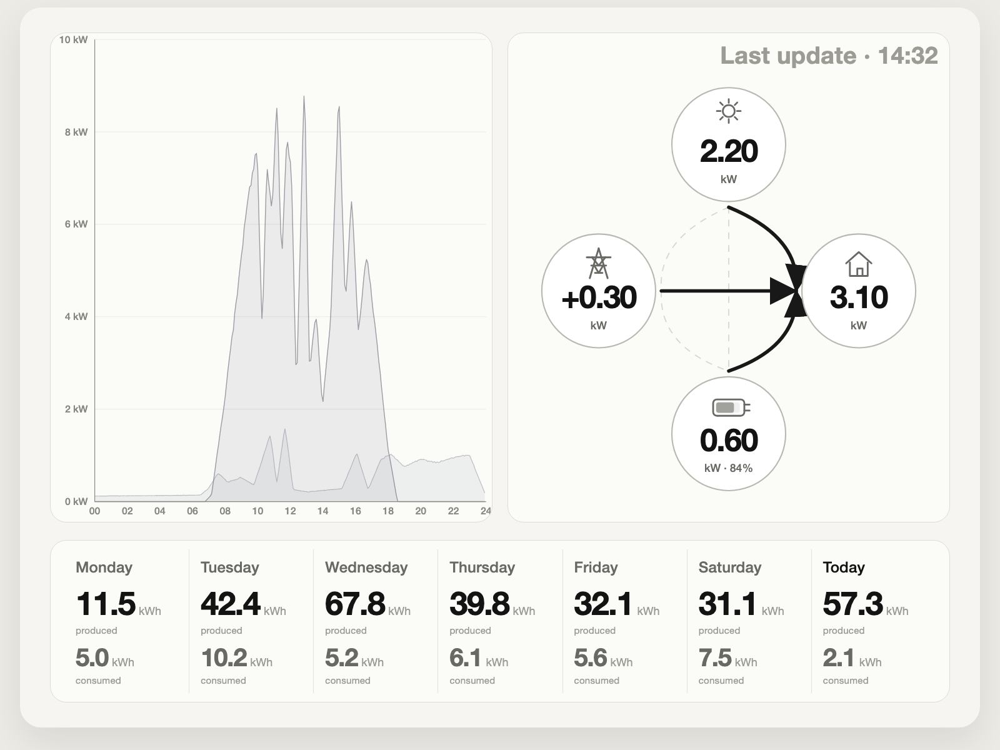
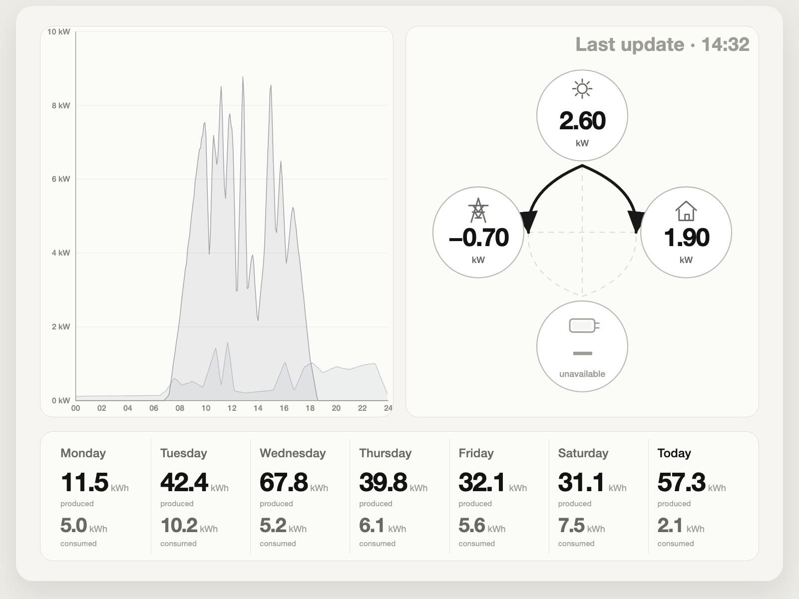

# Solar E-Ink Dashboard

A Raspberry Pi wall dashboard for Solar Manager with a Figma-aligned HTML/CSS/SVG preview, local SQLite history, and a layout optimized for a high-resolution grayscale E-Ink display.

## Screenshots




## Current Scope

The current main dashboard contains:

- live flow panel with `Solar`, `Grid`, `Home`, and `Battery`
- current-day 24h chart for production vs. consumption
- 7-day history strip with `produced` and `consumed`
- mock preview, state/scenario previews, and live preview from a real Solar Manager gateway

Not on the current main screen:

- extra KPI cards for import/export/self-consumption/autarky
- device list
- PV performance block

## Preview Modes

### Mock preview

```bash
./.venv312/bin/python main.py --mock --port 8090
```

Open:

- `http://127.0.0.1:8090/` for the default mock dashboard
- `http://127.0.0.1:8090/scenarios` for common fixed preview states

Supported scenario URLs:

- `/?scenario=pv_surplus`
- `/?scenario=pv_deficit`
- `/?scenario=night`
- `/?scenario=battery_support`
- `/?scenario=grid_charge`
- `/?scenario=no_battery`
- `/?scenario=stale`

### Live preview

```bash
./.venv312/bin/python main.py --port 8080
```

Open:

- `http://127.0.0.1:8080/`

Live mode uses your local Solar Manager gateway data via `/v2/stream`, with `/v2/point` as fallback.

## Local Configuration

Create a local `.env.local` in the repo root. This file stays out of git.

Example:

```dotenv
SM_LOCAL_BASE_URL=https://192.168.1.95
SM_LOCAL_API_KEY=your-local-api-key
SM_LOCAL_VERIFY_TLS=false
TZ=Europe/Zurich
WEB_HOST=127.0.0.1
WEB_PORT=8080
```

Important:

- use the Solar Manager gateway IP, not the inverter IP
- prefer `https`
- for many local gateways, certificate verification is not turnkey; use either
  - `SM_LOCAL_VERIFY_TLS=false`
  - or `SM_LOCAL_TLS_FINGERPRINT_SHA256=...`
  - or `SM_LOCAL_CA_BUNDLE=/path/to/ca.pem`

## Architecture

The current architecture is:

```text
Solar Manager Gateway
  ├── /v2/stream  (primary live source)
  └── /v2/point   (fallback snapshot)
          ↓
src/api_local.py
          ↓
src/storage.py      SQLite WAL
          ↓
src/aggregator.py   chart buckets + daily summaries
          ↓
src/models.py       DashboardData
          ↓
src/html_renderer.py
          ↓
src/web_preview.py  Flask preview
```

Notes:

- the HTML/CSS/SVG renderer is the primary visual path
- `src/renderer.py` still exists as a legacy PNG/Pillow fallback via `/dashboard.png`
- mock mode and live mode use separate SQLite databases

## Domain Rules

- local `Wh` values are interval values, not daily totals
- daily totals must be summed from all interval `Wh` samples
- `/v2/stream` is the correct primary source for intraday charting
- battery-aware grid power is:

```text
grid_w = c_w + bc_w - p_w - bd_w
```

Semantics:

- positive `grid_w` = import / Bezug
- negative `grid_w` = export / Einspeisung

## Hardware Target

Reference target:

- Raspberry Pi 5B
- Waveshare 7.8" e-Paper HAT with IT8951 controller
- resolution target: `1872x1404`

The current browser preview is the main design-validation path. A fully integrated HTML-to-PNG/E-Ink export path is still the next hardware-facing step.

## Development

Setup:

```bash
python3.12 -m venv .venv312
./.venv312/bin/pip install -r requirements.txt
```

Tests:

```bash
./.venv312/bin/pytest -q
RUN_LOCAL_SM_TESTS=1 ./.venv312/bin/pytest tests/test_local_api_integration.py -v
```

Useful local files:

- `tmp/solar-eink-dashboard-PROJECT.md`
- `tmp/Solar Manager API.pdf`
- `.ai/solar-manager-eink-dashboard-context.md`
- `CLAUDE.md`

## Status

What is already working:

- mock dashboard preview
- live preview with real gateway data
- scenario previews for common flow states
- correct local persistence and current-day aggregation
- Figma-aligned HTML/CSS/SVG renderer

What is still open:

- final HTML-to-PNG export path for the actual E-Ink device
- hardware refresh strategy and deployment polish on Raspberry Pi
- optional backfill for incomplete day history after restart
