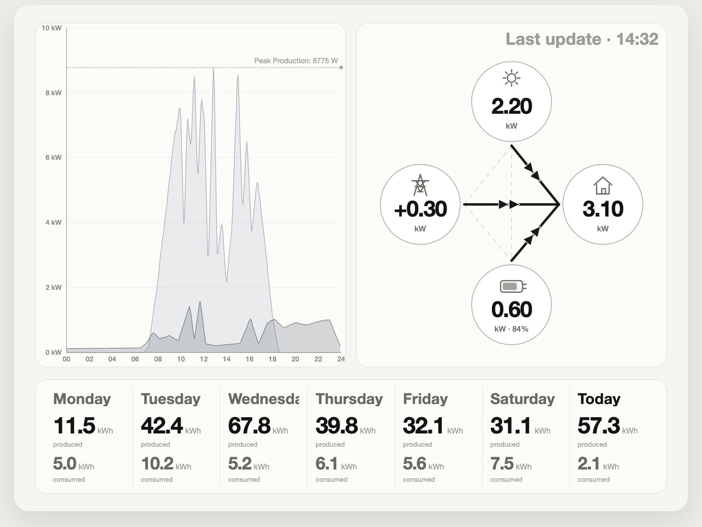
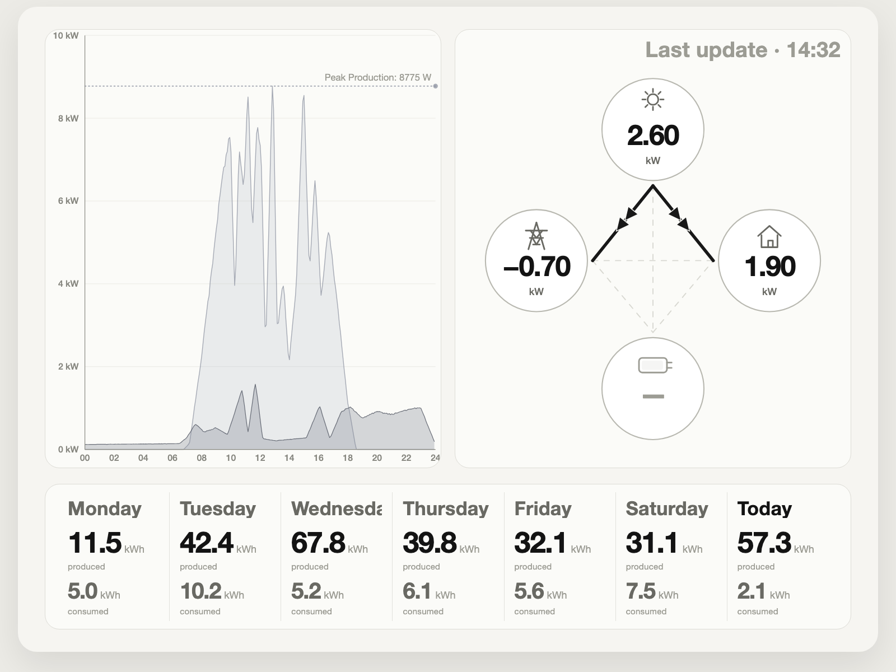
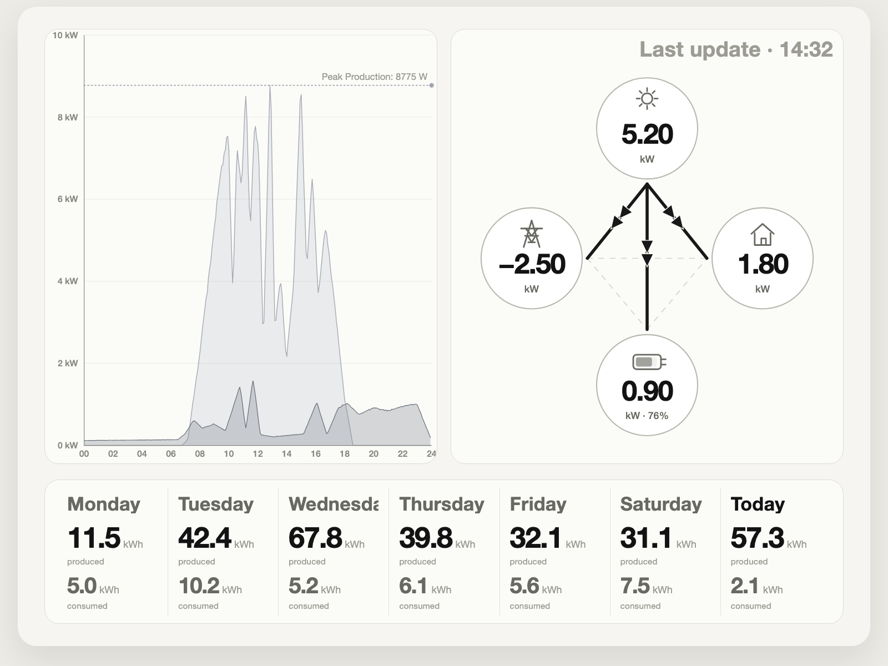

# Solar E-Ink Dashboard

A Raspberry Pi wall dashboard for Solar Manager with a Figma-aligned HTML/CSS/SVG preview, local SQLite history, and a layout optimized for a high-resolution grayscale E-Ink display.

## Screenshots





## Current Scope

The current main dashboard contains:

- live flow panel with `Solar`, `Grid`, `Home`, and `Battery`
- straight live-flow paths with centered double arrowheads on active connections
- current-day 24h chart for production vs. consumption
- peak production marker line aligned to the displayed production curve
- 7-day history strip with `produced` and `consumed`
- mock preview, state/scenario previews, and live preview from a real Solar Manager gateway
- optional HTML-to-PNG export path for the E-Ink target
- optional cloud backfill for missing previous days and the current-day startup gap
- configurable dashboard language: `EN`, `DE`, `FR`, `IT`

Not on the current main screen:

- extra KPI cards for import/export/self-consumption/autarky
- device list
- PV performance block

## Preview Modes

### Mock preview

```bash
./.venv312/bin/python main.py --mock --port 8090
```

Open:

- `http://127.0.0.1:8090/` for the default mock dashboard
- `http://127.0.0.1:8090/scenarios` for common fixed preview states

Supported scenario URLs:

- `/?scenario=pv_surplus`
- `/?scenario=pv_deficit`
- `/?scenario=night`
- `/?scenario=battery_support`
- `/?scenario=grid_charge`
- `/?scenario=no_battery`
- `/?scenario=stale`

These scenario previews keep the same 24h chart context, including the peak-production marker.

### Live preview

```bash
./.venv312/bin/python main.py --port 8080
```

Open:

- `http://127.0.0.1:8080/`

Live mode uses your local Solar Manager gateway data via `/v2/stream`, with `/v2/point` as fallback.
The browser preview auto-refreshes every 15 seconds.

### PNG export

```bash
./.venv312/bin/python main.py --mock --export-png out/dashboard.png
./.venv312/bin/python main.py --export-png out/live-dashboard.png
```

The export path renders the same HTML/CSS/SVG dashboard through Playwright and writes a PNG at `1872x1404`.
By default, the output is quantized to 16 grayscale levels for the E-Ink target.

## Local Configuration

Create a local `.env.local` in the repo root. This file stays out of git.

Example:

```dotenv
SM_LOCAL_BASE_URL=https://192.168.1.95
SM_LOCAL_API_KEY=your-local-api-key
SM_LOCAL_VERIFY_TLS=false
DASHBOARD_LANGUAGE=EN
SM_CLOUD_BACKFILL_ENABLED=false
TZ=Europe/Zurich
WEB_HOST=127.0.0.1
WEB_PORT=8080
```

Important:

- use the Solar Manager gateway IP, not the inverter IP
- prefer `https`
- for many local gateways, certificate verification is not turnkey; use either
  - `SM_LOCAL_VERIFY_TLS=false`
  - or `SM_LOCAL_TLS_FINGERPRINT_SHA256=...`
  - or `SM_LOCAL_CA_BUNDLE=/path/to/ca.pem`
- `DASHBOARD_LANGUAGE` supports `EN` (default), `DE`, `FR`, `IT`

### Optional cloud backfill

The local gateway API has no historical backfill endpoint.
If you want missing daily history after a restart, configure the optional cloud backfill:

```dotenv
SM_CLOUD_BACKFILL_ENABLED=true
SM_CLOUD_EMAIL=you@example.com
SM_CLOUD_PASSWORD=your-password
SM_CLOUD_SMID=your-smid
SM_CLOUD_BACKFILL_DAYS=7
SM_CLOUD_BACKFILL_INTERVAL_SECONDS=300
```

Current behavior:

- previous full days are backfilled into `daily_summary`
- the current-day gap before the first local sample is backfilled into `raw_points`
- this avoids double counting once the local stream is running

## Architecture

The current architecture is:

```text
Solar Manager Gateway
  ├── /v2/stream  (primary live source)
  └── /v2/point   (fallback snapshot)
          ↓
src/api_local.py
          ↓
src/storage.py      SQLite WAL
          ↓
src/aggregator.py   chart buckets + daily summaries
          ↓
src/models.py       DashboardData
          ↓
src/html_renderer.py
          ↓
src/web_preview.py  Flask preview
          ↓
src/export_dashboard.py  PNG export via Playwright
```

Notes:

- the HTML/CSS/SVG renderer is the primary visual path
- `src/renderer.py` still exists as a legacy PNG/Pillow fallback via `/dashboard.png`
- mock mode and live mode use separate SQLite databases
- the optional cloud backfill uses `/v1/statistics/gateways/{smId}` and `/v3/users/{smId}/data/range`
- active live-flow paths currently use straight 45°/orthogonal lines with centered double arrowheads

## Domain Rules

- local `Wh` values are interval values, not daily totals
- daily totals must be summed from all interval `Wh` samples
- `/v2/stream` is the correct primary source for intraday charting
- battery-aware grid power is:

```text
grid_w = c_w + bc_w - p_w - bd_w
```

Semantics:

- positive `grid_w` = import / Bezug
- negative `grid_w` = export / Einspeisung
- the 7-day history strip shows daily **energy**, so the correct unit is `kWh`, not `kW`
- EV/car `soc` must not be mistaken for a home battery SOC in the live battery node

## Hardware Target

Reference target:

- Raspberry Pi 5B
- Waveshare 7.8" e-Paper HAT with IT8951 controller
- resolution target: `1872x1404`

The current browser preview is the main design-validation path. A fully integrated HTML-to-PNG/E-Ink export path is still the next hardware-facing step.
The HTML-to-PNG export path now exists; the remaining hardware-facing work is the actual IT8951 display integration and refresh strategy.

## Development

Setup:

```bash
python3.12 -m venv .venv312
./.venv312/bin/pip install -r requirements.txt
./.venv312/bin/python -m playwright install chromium
```

Tests:

```bash
./.venv312/bin/pytest -q
RUN_LOCAL_SM_TESTS=1 ./.venv312/bin/pytest tests/test_local_api_integration.py -v
```

Useful local files:

- `tmp/solar-eink-dashboard-PROJECT.md`
- `tmp/Solar Manager API.pdf`
- `.ai/solar-manager-eink-dashboard-context.md`
- `CLAUDE.md`

## Status

What is already working:

- mock dashboard preview
- live preview with real gateway data
- scenario previews for common flow states
- correct local persistence and current-day aggregation
- Figma-aligned HTML/CSS/SVG renderer
- peak-production marker in the 24h chart aligned to the visible production curve
- PNG export from the HTML renderer
- optional i18n for `EN`, `DE`, `FR`, `IT`
- optional cloud backfill for missing daily history and the current-day startup gap

What is still open:

- hardware refresh strategy and deployment polish on Raspberry Pi
- direct IT8951 display integration from the exported PNG path
